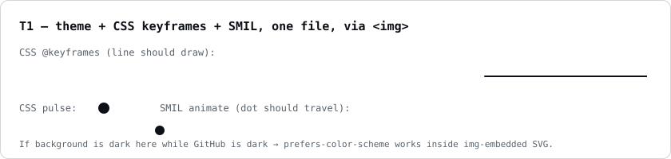
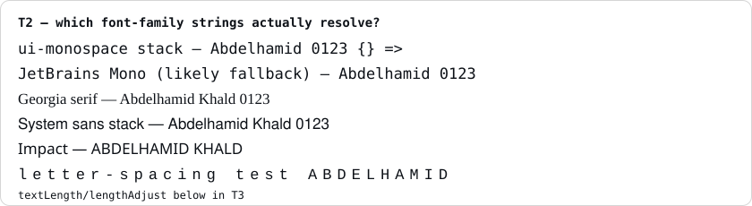

# RENDER LAB

## T1 — one SVG: theme-aware + CSS keyframes + SMIL (relative path)



## T1b — same SVG via raw.githubusercontent (camo path)


## T2 — font resolution inside SVG



## T3 — INLINE SVG (expect: stripped)

<svg xmlns="http://www.w3.org/2000/svg" width="300" height="60">
  <rect width="300" height="60" fill="#f00"/>
  <text x="10" y="35" fill="#fff" font-size="20">INLINE SVG RENDERED</text>
</svg>

INLINE-SVG-MARKER-END

## T4 — style attribute (expect: stripped)

<div style="background:#ff0000;color:#fff;padding:20px;font-size:24px">STYLE ATTRIBUTE APPLIED</div>

## T5 — align attribute on div (expect: works)

<div align="center">THIS SHOULD BE CENTERED</div>

## T6 — picture + prefers-color-scheme

<picture>
  <source media="(prefers-color-scheme: dark)" srcset="assets/t1-theme-smil-css.svg">
  <source media="(prefers-color-scheme: light)" srcset="assets/t2-fonts.svg">
  
</picture>

## T7 — table as layout grid

<table>
<tr>
<td width="50%" valign="top">

**Cell A** — left column content with a [link](https://github.com) and `code`.

</td>
<td width="50%" valign="top">

**Cell B** — right column content.

</td>
</tr>
</table>

## T8 — details/summary

<details>
<summary>Click to expand</summary>

Hidden content is here.

</details>

## T9 — img inside a (clickable image)

<a href="https://github.com/AbdelhamidKhald"></a>

## T10 — foreignObject inside img-embedded SVG



## T11 — code fence box drawing alignment

```
┌──────────────────────────────┬───────────────┐
│ system                       │ status        │
├──────────────────────────────┼───────────────┤
│ nexshop                      │ ████████░░ 80 │
│ nctu-sis                     │ ██████████ 99 │
└──────────────────────────────┴───────────────┘
```

## T12 — heading anchors + emoji-free h2 spacing

### Sub heading under test

Paragraph.
