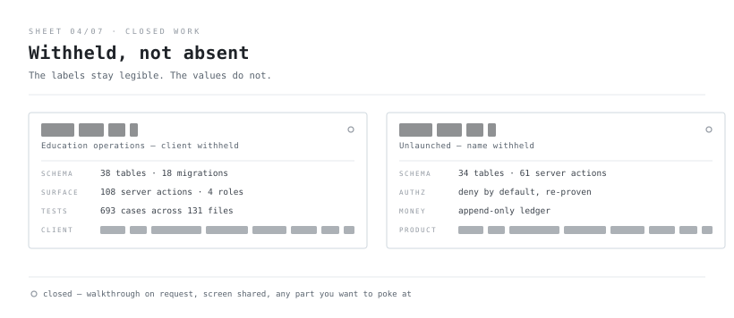
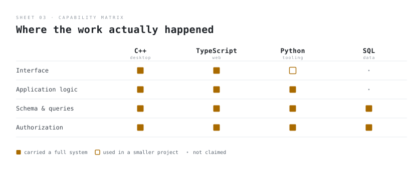
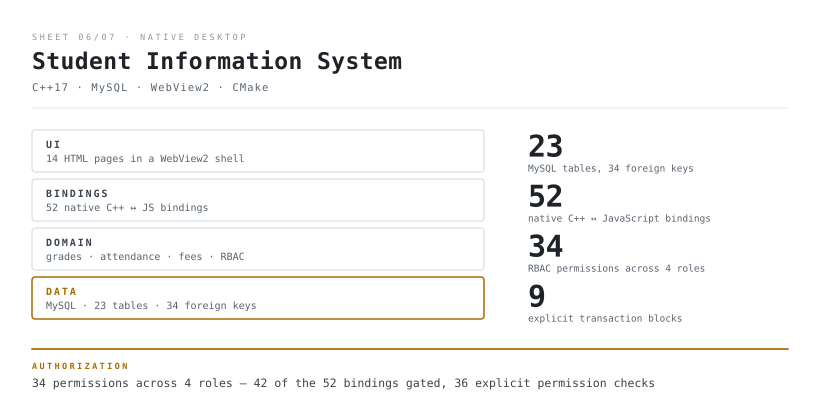
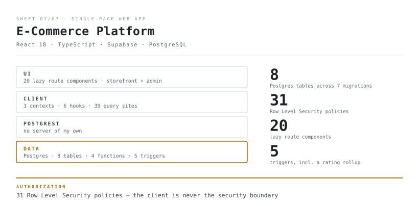

<picture>
  <source media="(max-width: 500px) and (prefers-color-scheme: dark)" srcset="assets/hero-narrow-dark.svg">
  <source media="(max-width: 500px)" srcset="assets/hero-narrow-light.svg">
  <source media="(prefers-color-scheme: dark)" srcset="assets/hero-dark.svg">
  
</picture>

**I build the load-bearing parts of systems — auth, roles, schemas, ledgers, admin surfaces.**
The kind where somebody has to log in, somebody else must not see the data, and a wrong write is
not a cosmetic bug.

Across every one of them I end up in the same place. The interface is not allowed to be the
security boundary. The thing that decides has to be the thing that stores.

Student developer, open to internships and freelance work. Reach me at
**[abdelhamidkhaldacc@gmail.com](mailto:abdelhamidkhaldacc@gmail.com)**.

 

---

## The two you can open right now

Most of my work is closed. These two are not — they are live, they are the best things I have
worked on, and you can go and use them before you finish reading this page.

 

<picture>
  <source media="(max-width: 500px) and (prefers-color-scheme: dark)" srcset="assets/agora-narrow-dark.svg">
  <source media="(max-width: 500px)" srcset="assets/agora-narrow-light.svg">
  <source media="(prefers-color-scheme: dark)" srcset="assets/agora-dark.svg">
  
</picture>

### [Agora AI →](https://agora-ai.fly.dev)

Most study apps are five separate CRUD features sharing a login. Your notes do not know you just
failed a quiz. Your flashcards do not know you spent forty minutes reading about the same concept
this morning. Agora starts from the opposite constraint: **every feature has to write to one
append-only ledger, and everything else is derived from it.**

A chat turn, a note, an uploaded document, a flashcard review, a quiz attempt, a finished focus
session — eight typed kinds of evidence, one write path. Nothing writes mastery directly. Recording
an event appends it, recomputes mastery for exactly the concepts that event touched, and regenerates
the open coaching interventions. That is the difference between genuinely shared state and five
features that happen to point at the same database.

The part I would want to be asked about: mastery is not a weighted average. A concept's entire
evidence log is replayed in order through a real spaced-repetition memory model, so forgetting
curves fall out of the maths instead of being approximated by a heuristic. Working out how a chat
message and a flashcard rating end up on the same scale is the genuinely hard problem in there — and
it is the one thing on this page I am deliberately not publishing.

On top of that sits an agent that can actually act on your data: **143 tools** reached through
**24 specialists**. The planner never sees the tools. It reads two dozen short specialist
descriptions, decides which to run in parallel, and only the chosen specialist is ever handed tool
schemas — each specialist's roster capped at six. That separation is what keeps the cost of a turn
flat while the tool count grows.

Then the three numbers along the bottom of the sheet, which are the reason this project is at the
top of the page:

> The re-plan cap, the revision cap and the turn budget are `if` statements, not sentences in a
> system prompt. A re-plan whose steps only name agents that already failed is thrown away, because
> repeating a failed agent is not recovery. When the turn budget runs out, the graph returns its
> best answer so far instead of cancelling and losing the work.

Same instinct as everything else on this page. A prompt can ask. Only code can enforce.

**This is a team project — ten contributors, and 203 of the 352 commits are mine.** I would rather
say that in the first line than have you find it in the contributor graph. Ask me which parts and I
will walk you through the commits.

 

<picture>
  <source media="(max-width: 500px) and (prefers-color-scheme: dark)" srcset="assets/quran-narrow-dark.svg">
  <source media="(max-width: 500px)" srcset="assets/quran-narrow-light.svg">
  <source media="(prefers-color-scheme: dark)" srcset="assets/quran-dark.svg">
  
</picture>

<!-- The Latin name leads deliberately. A heading whose first strong character is Arabic takes RTL
     as its base direction for the whole line, which right-aligns the link and pushes the Arabic
     off the edge of the content column. Starting in Latin keeps the paragraph LTR; the Arabic run
     inside it still renders correctly right-to-left on its own. -->
### [Hifz Kids · حِفظ كيدز →](https://thfez-al-qran-v2.fly.dev/)

Arabic-first — not an English app with Arabic bolted on afterwards. The interface, the content and
the reading direction all start from Arabic, because a six-year-old memorising Qur'an is not going
to meet you halfway.

The chart on that sheet is the actual engineering problem, drawn to scale. There are 114 surahs and
6,236 ayat, and the distribution is brutally lopsided: **half of the entire text sits in just 22 of
the 114 surahs.** Al-Baqarah alone is 286 ayat — more than the final twenty-seven surahs put
together. A plan that treats those as interchangeable units is useless, so the app builds a daily
path fitted to one child's time and level instead of handing them a list and wishing them luck.

Wrapped around that is the part nobody puts on an architecture diagram: the hard problem in
memorisation is not the content, it is coming back tomorrow. So there are stars, badges and contests
against friends. Educational games. Islamic studies — hadith, fiqh and seerah. An assistant to ask
when something does not make sense.

And a signed Android build on the same account as the web, which keeps working when the network does
not: save the surahs you are working on, listen to the recitation, then record your own and hear it
back.

 

---

## And the two I can't

<picture>
  <source media="(max-width: 500px) and (prefers-color-scheme: dark)" srcset="assets/closed-narrow-dark.svg">
  <source media="(max-width: 500px)" srcset="assets/closed-narrow-light.svg">
  <source media="(prefers-color-scheme: dark)" srcset="assets/closed-dark.svg">
  
</picture>

One runs a real programme for a real client, so its name and the rules at the centre of it are not
mine to publish. The other is unlaunched. They are struck out rather than quietly left off the page,
so you can see the shape of what is missing rather than wondering whether anything is there.

**I will walk either of them through live.** Screen shared, twenty minutes, any part you want to
poke at. That is the only honest answer to a private repository, and the offer is open.

<b>Three more on the closed shelf</b>

 

**A retail commerce platform** — Django and React, shipped and running. Order totals are recomputed
server-side inside the same transaction that reserves stock, so a tampered checkout payload changes
nothing. There is a regression test that submits one and asserts it is ignored.

**A cryptography playground** — Flask and Socket.IO. Encrypted multi-user chat, plus a node editor
where you drag cipher primitives onto a canvas, wire them through typed ports, and execute the
graph as a dataflow.

**A typing engine** — a framework-agnostic TypeScript package that models inter-key latency, rhythm
variance and two-character timing. How you type, not just what you type. Unfinished.

 

---

## What you can actually read

Everything above is either closed or shared with a team. So here are two systems you can open,
clone and run on your own machine, chosen because they show the same instinct in public.

<picture>
  <source media="(max-width: 500px) and (prefers-color-scheme: dark)" srcset="assets/matrix-narrow-dark.svg">
  <source media="(max-width: 500px)" srcset="assets/matrix-narrow-light.svg">
  <source media="(prefers-color-scheme: dark)" srcset="assets/matrix-dark.svg">
  
</picture>

 

<picture>
  <source media="(max-width: 500px) and (prefers-color-scheme: dark)" srcset="assets/system-nctu-narrow-dark.svg">
  <source media="(max-width: 500px)" srcset="assets/system-nctu-narrow-light.svg">
  <source media="(prefers-color-scheme: dark)" srcset="assets/system-nctu-dark.svg">
  
</picture>

A desktop student information system: a C++17 core talking to MySQL through the raw C API, with the
interface rendered as HTML inside a native WebView2 window. Professors are scoped to the courses
they were actually assigned, so the UI cannot be used to reach a grade it should not reach.

Three things in it I wrote by hand rather than installed:

- a **149-line JSON serializer** with correct control-character escaping — there is no JSON library anywhere in the project
- a **308-line RAII wrapper** over the raw MySQL C API, so result sets are released deterministically
- a **grade engine** that rolls a credit-hour-weighted CGPA over per-course mark distributions

This is university coursework, and I would rather say so than have you wonder. The coursework
framing is not the weakness — the missing tests are.

**[Read the code →](https://github.com/AbdelhamidKhald/C-Ass-2-Full-University-System-)**

 

<picture>
  <source media="(max-width: 500px) and (prefers-color-scheme: dark)" srcset="assets/system-nexshop-narrow-dark.svg">
  <source media="(max-width: 500px)" srcset="assets/system-nexshop-narrow-light.svg">
  <source media="(prefers-color-scheme: dark)" srcset="assets/system-nexshop-dark.svg">
  
</picture>

A storefront and an admin dashboard over Postgres, with no API server of my own — Row Level
Security is the authorization layer, and PostgREST is the transport.

I scaffolded this one with AI assistance. The commits after the first one are the part worth
reading, because that is where I ran it and it broke:

> The admin read policy on `profiles` queried `profiles` to work out whether the caller was an
> admin. Postgres recursed, and every admin query died. The fix was to lift the check out of the
> policy into a `SECURITY DEFINER` function, then rewrite **11 policies across 5 tables** to call
> it.

That bug is not findable by reading. You only get it by running the thing.

**[Read the code →](https://github.com/AbdelhamidKhald/fullstack-ecommerce-platform)**

 

## Range

Smaller, finished things.

**[Perplexity desktop client](https://github.com/AbdelhamidKhald/perplexity-ai-gui-client)** · `Python`
 A hand-written server-sent-events parser streamed into Tkinter across a daemon thread and a
`queue.Queue` drained by the event loop — the way to stream into a UI toolkit without freezing it.

**[Tic-tac-toe, minimax](https://github.com/AbdelhamidKhald/X-O-Game)** · `JavaScript`
 A minimax search behind three tiers — random, a 50/50 mix, and perfect play — on a focusable
button grid with an aria-live status region.

**[Fawry Quantum challenge](https://github.com/AbdelhamidKhald/ecommerce-system-cpp)** · `C++`
 A 174-line checkout kata written against a company internship brief.

 

## The awkward part

The code you can actually read here is my oldest work, and none of it has a test that asserts
anything. The systems I would rather point at have 664 and 693 test cases — and those are closed or
shared, so you have my word and nothing else. That is not evidence, and I am not going to pretend it
is. It is also exactly why the offer of a live walkthrough sits at the top of this page instead of
the bottom.

 

---

**[abdelhamidkhaldacc@gmail.com](mailto:abdelhamidkhaldacc@gmail.com)**

